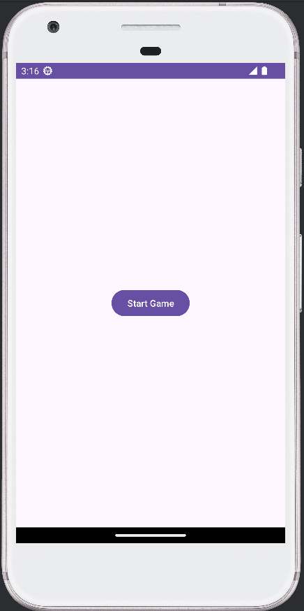
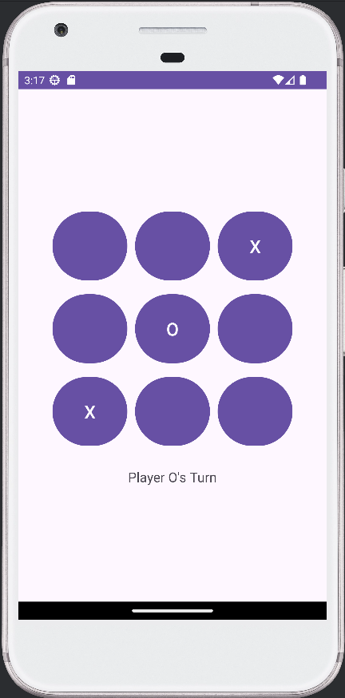

# Tic-Tac-Toe Game

This `README.md` provides an overview of the project, installation and setup instructions, usage guidelines, and other relevant information for anyone who wants to use or contribute to the project.

A simple Tic-Tac-Toe game for Android implemented in Java using Android Studio.

## Features

- Home screen with a "Start Game" button.
- A Tic-Tac-Toe game board with 3x3 grid.
- Player turn indicator.
- Displays the winner or if it's a draw.
- Automatically returns to the home screen after the game ends.

## Screenshots

## Requirements

- Android Studio (latest version recommended)
- Android SDK
- Java Development Kit (JDK)

## Installation and Setup

### Clone the Repository

Open a terminal and clone the repository:
git clone https://github.com/3p10/TicTacToe-App

### Open the Project in Android Studio

- Launch Android Studio.
- Select File > Open... from the menu.
- Navigate to the cloned repository directory and click OK.

### Build the Project

- Once the project is loaded in Android Studio, let it sync and build the project.
- If prompted, install any necessary SDK or plugin updates.

### Run the Project

- Connect an Android device via USB or start an Android Virtual Device (AVD) emulator.
- Click on the Run button in Android Studio or press Shift + F10.
- Select your device or emulator from the list and click OK.

### Project Structure

- MainActivity.java: Contains the home screen with the "Start Game" button.
- GameActivity.java: Contains the game logic and UI for the Tic-Tac-Toe game.
- res/layout/activity_main.xml: Layout file for the home screen.
- res/layout/activity_game.xml: Layout file for the game screen.
- AndroidManifest.xml: Declares the application's activities.

### Usage

- Launch the app on your Android device or emulator.
- Click the "Start Game" button on the home screen to begin a new game.
- Play the game by clicking on the grid buttons. The game will indicate whose turn it is.
- Once the game ends, the result (win or draw) will be displayed, and after a short delay, it will return to the home screen.
